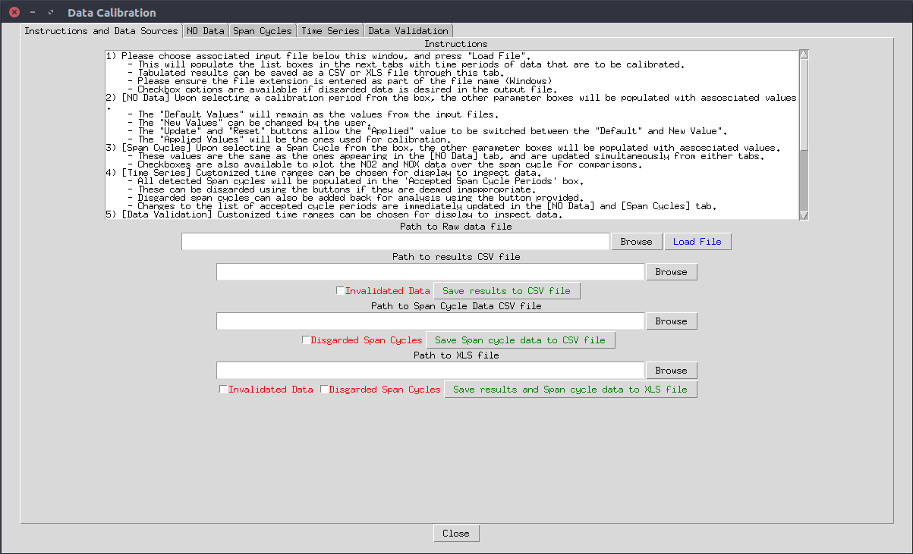
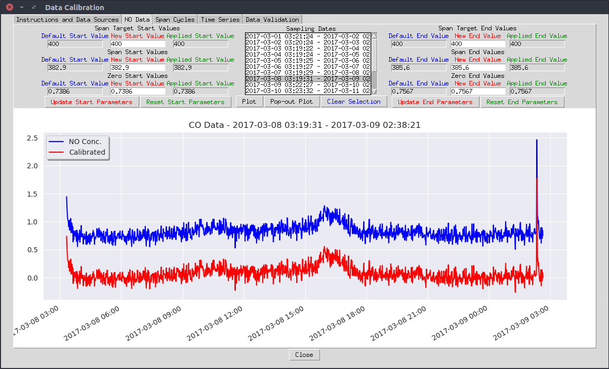
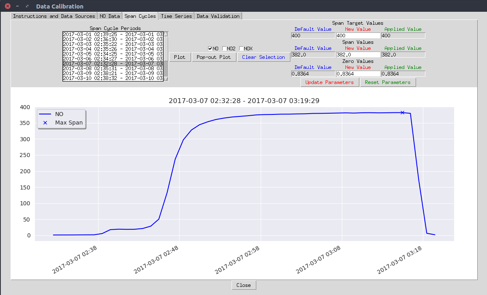
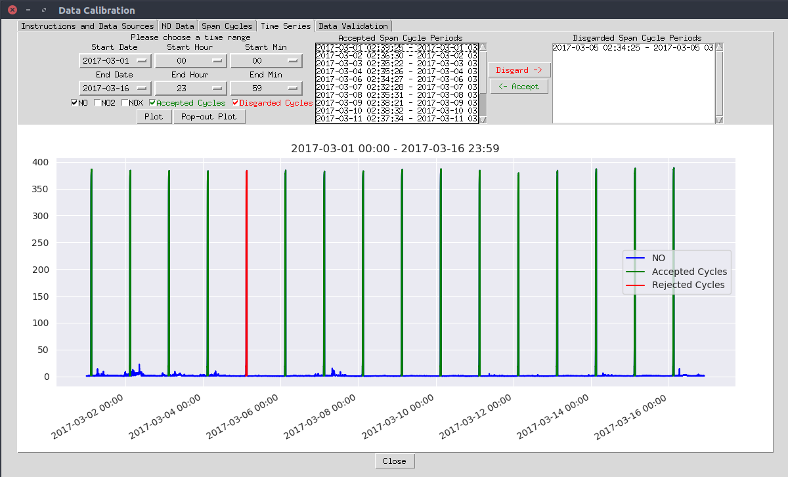
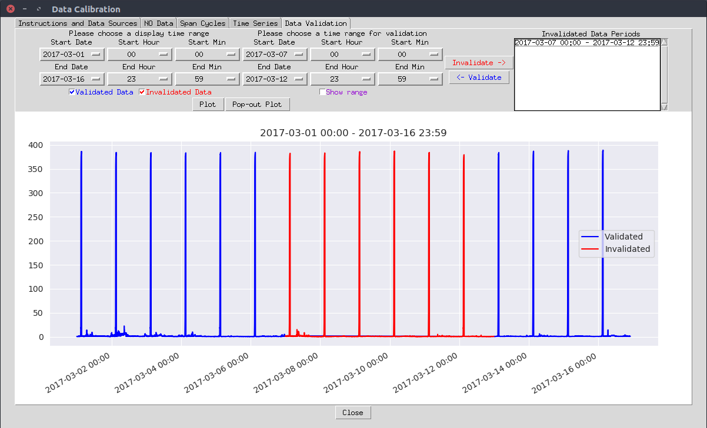

# NOxCalibration #

## General Overview ##

This is a simple software with a Graphical User Interface written in python, with the intention of assisting the calibration of data collected from NOx analyzers.

NOx analyzers are commonly used in the air quality monitoring discipline. The NOx concentration detected in the air is actually the sum of NO and NO2 concentrations. They are usually program to perform regular calibration cycles before being deployed in the field. The values obtained during these cycles are used to calibrate the measurements during data post-processing.

The highest and the lowest values obtained during each of the cycles are used as benchmarks to calibrate the measurements between cycles. These values are used to determine the progressive change in offset and multiplicative k-factor for the measurements between cycles. Exact details of the algorithms involved are explained in NOxCalibrationLogic.dox in the repository.

This interface is designed to assist the calibration process. It provides the visualization of the difference between the raw measurements and the data calibrated using the corresponding values of the cycles. The user can manually exclude cycles and/or ranges of data accordingly, as well as adjusting the calibration values as they see fit. Once all of the required changes are confirmed, the processed data can be exported in csv format.

## Remarks ##

This software was originally written in Python 2.7 in a linux environment, and was converted to become compatible with Python 3.x. Several libraries such as **tkinter**, **pandas**, **pandasql** and **seaborn** may need to be installed via pip to run the application. Small adjustments to the code might be required to run the application under the Windows environment.

## Screenshots ##

The following are a few screenshots of the application:

